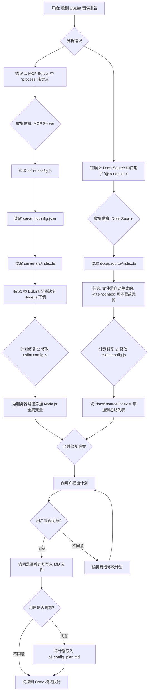

# ESLint 错误修复计划

## 问题分析

通过检查 ESLint 错误报告和相关源代码文件，确定了以下两个主要问题：

1.  **`'process' is not defined` 错误 (在 `app/project-graph-cli-mcp-server/build/index.js`)**:
    - **原因**: 根目录的 `eslint.config.js` 默认配置了浏览器环境 (`globals.browser`)，但 MCP 服务器 (`app/project-graph-cli-mcp-server/src/index.ts`) 是在 Node.js 环境中运行的。因此，ESLint 不认识 Node.js 的全局变量 `process`。
    - **源代码**: `app/project-graph-cli-mcp-server/src/index.ts` 中确实使用了 `process.cwd()` 和 `process.exit(1)`，这在 Node.js 中是标准用法。
2.  **`Do not use "@ts-nocheck"` 错误 (在 `docs/.source/index.ts`)**:
    - **原因**: `docs/.source/index.ts` 文件开头使用了 `// @ts-nocheck` 来跳过 TypeScript 类型检查。这违反了项目配置的 `@typescript-eslint/ban-ts-comment` ESLint 规则。
    - **文件特性**: 该文件看起来是由 `fumadocs-mdx` 工具链自动生成的，包含了大量动态导入和配置。在这种情况下，使用 `@ts-nocheck` 可能是为了避免处理复杂的或由工具链引入的类型问题。

## 修复方案

为了解决这些 ESLint 错误，计划进行以下修改：

1.  **修改 `eslint.config.js` 以支持 Node.js 环境**:
    - 在 `eslint.config.js` 中为 MCP 服务器的源代码目录 (`app/project-graph-cli-mcp-server/src/`) 添加一个特定的配置块。
    - 在这个配置块中，将 `languageOptions.globals` 设置为包含 Node.js 的全局变量 (`globals.node`)。
2.  **修改 `eslint.config.js` 以忽略自动生成的文档文件**:
    - 将 `docs/.source/index.ts` 添加到 `eslint.config.js` 的 `ignores` 数组中。

## 计划概览 (Mermaid)

## 下一步

在用户确认此计划后，将切换到 Code 模式以执行 `eslint.config.js` 的修改。
